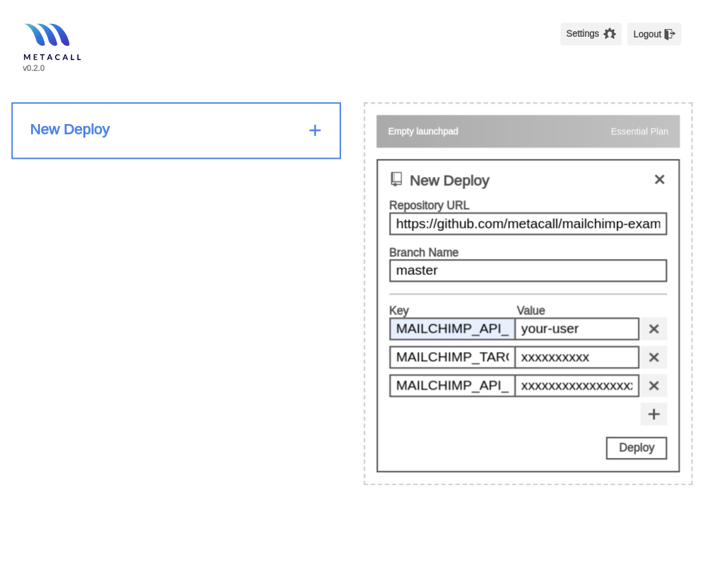
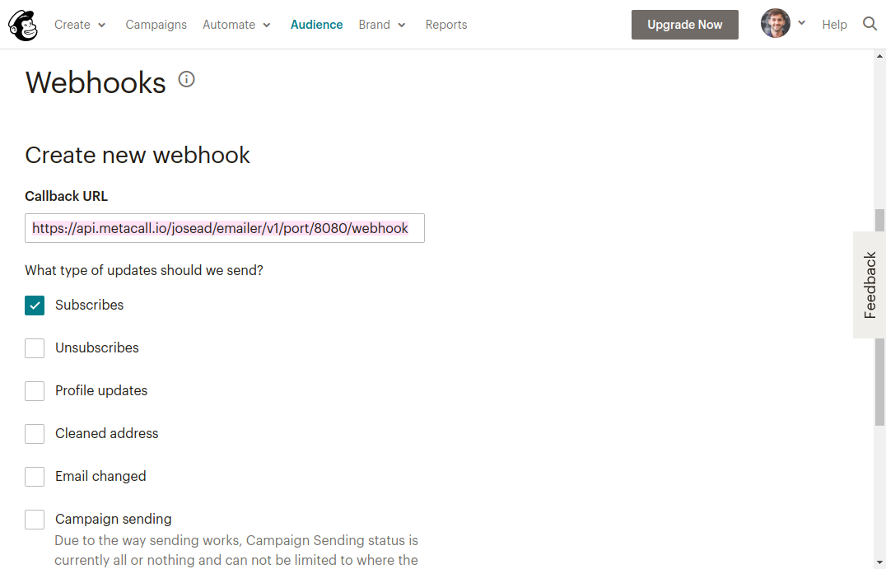

# Use MetaCall FaaS to setup your subscriber function.

Login into to MetaCall FaaS:

[https://dashboard.metacall.io](https://dashboard.metacall.io)

Along with this Mailchimp Example repository and the branch, you simply add the environment variables corresponding to your mailchimp account configuration:

> MAILCHIMP_API_USERNAME=authusername
>
> MAILCHIMP_API_KEY=xxxxxxxxxxxxxxxxxxxxxxxxxxxxxxxx-xxxx
>
> MAILCHIMP_TARGET_LIST=xxxxxxxxxx

After deployment you should see something like this.

Now you can start using your new async function as an endpoint using the **await** route

`curl -X POST https://api.metacall.io/<your_alias>/mailchimp-example/v1/await/subscribe -X POST --data '{ "email": "your_email@domain.com" }'`

# Extra: Use Express in FaaS as webhook endpoint

If you go into `mailchimp.js` you can see we've instanciated an **express server** with an endpoint called '/webhook'. This is useful to configure a after-subscription webhook [(or any of the like)](https://mailchimp.com/developer/guides/about-webhooks/) and perform actions in it.

To do so, you take the url with the **port** route `https://api.metacall.io/<your_alias>/mailchimp-example/v1/port/8080/webhook` and place it in Mailchimp's webhook url box.

That's it, Enjoy MetaCall!
